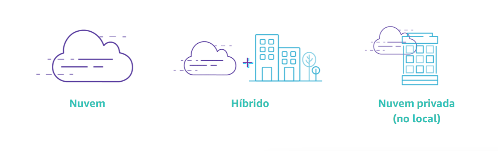
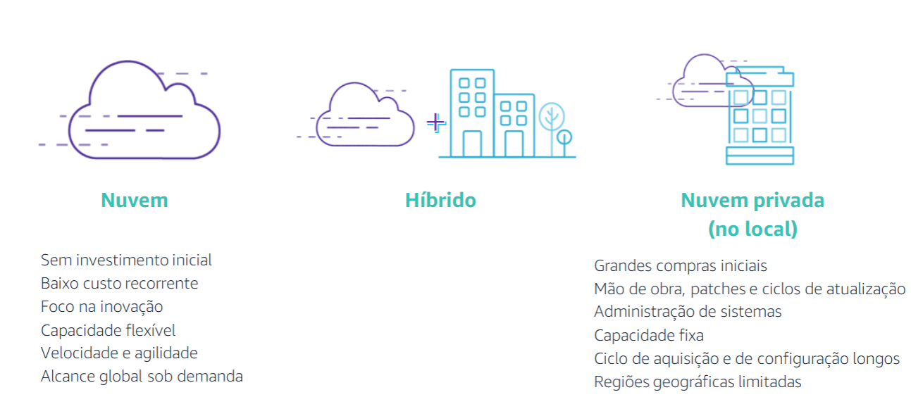
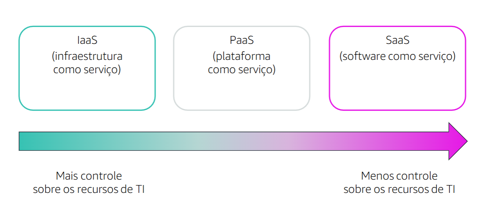

☁️ Computação em Nuvem

A computação em nuvem revolucionou a forma como armazenamos, processamos e acessamos dados, proporcionando maior flexibilidade, escalabilidade e eficiência para empresas e indivíduos. Este documento explora os conceitos fundamentais, tipos de serviços e vantagens dessa tecnologia.

🌍 O que é Computação em Nuvem?

A computação em nuvem (Cloud Computing) é um modelo que permite o acesso sob demanda a recursos computacionais (servidores, armazenamento, redes, software) por meio da internet. Isso elimina a necessidade de infraestrutura física local e facilita o gerenciamento de dados e aplicações.

🚀 Benefícios da Computação em Nuvem

✅ Escalabilidade: Permite aumentar ou reduzir os recursos conforme a demanda.
✅ Acessibilidade: Os serviços podem ser acessados de qualquer lugar com conexão à internet.
✅ Redução de Custos: Elimina investimentos pesados em hardware e manutenção.
✅ Segurança: Provedores oferecem criptografia, backup e protocolos robustos.
✅ Colaboração: Permite trabalho remoto e compartilhamento de dados em tempo real.

☁️ Modelos de Nuvem

🔹 Nuvem Pública: Serviços oferecidos por terceiros (ex: AWS, Google Cloud, Azure).
🔹 Nuvem Privada: Infraestrutura dedicada exclusivamente a uma organização.
🔹 Nuvem Híbrida: Combina nuvens públicas e privadas, oferecendo flexibilidade.
🔹 Nuvem Comunitária: Compartilhada entre organizações com interesses comuns.

🛠️ Modelos de Serviço em Nuvem

📌 IaaS (Infrastructure as a Service)
Fornece infraestrutura virtualizada, incluindo servidores, armazenamento e redes.
Exemplo: AWS EC2, Google Compute Engine.

📌 PaaS (Platform as a Service)
Oferece uma plataforma para desenvolvimento, com ferramentas para criar, testar e implantar aplicações.
Exemplo: Google App Engine, Microsoft Azure App Service.

📌 SaaS (Software as a Service)
Aplicações prontas para uso, acessíveis via navegador.
Exemplo: Gmail, Google Drive, Dropbox.

🔒 Segurança na Nuvem

A segurança na nuvem envolve diversas práticas para proteger dados e sistemas, incluindo:

🔐 Criptografia – Proteção de dados em trânsito e em repouso.
🔐 Autenticação Multifator (MFA) – Reforço na identificação de usuários.
🔐 Backups Regulares – Prevenção contra perda de dados.
🔐 Monitoramento Contínuo – Detecção de ameaças em tempo real.

🔮 O Futuro da Computação em Nuvem

🌟 Computação sem Servidor (Serverless) – Execução de aplicações sem gerenciamento de servidores.
🌟 Inteligência Artificial e Machine Learning na Nuvem – Maior automação e análise de dados.
🌟 Edge Computing – Processamento de dados mais próximo da fonte, reduzindo latência.
🌟 Computação Quântica – Potencial para resolver problemas complexos rapidamente.

📚 Conclusão

A computação em nuvem é uma tecnologia essencial para o mundo moderno, oferecendo eficiência, escalabilidade e segurança. Seu impacto continuará crescendo, impulsionando inovações em diversas áreas, desde negócios até pesquisa científica.

💡 Seja parte dessa revolução digital e aproveite os benefícios da nuvem!

✉️ Dúvidas ou sugestões? Entre em contato!
